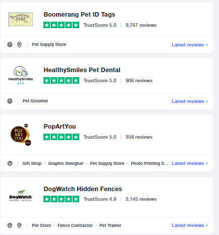

# [TrustPilot.com](https://www.trustpilot.com) Scraper

## ITC - Data Science course 2022 - Data Mining project

[Github](https://github.com/aylior/ITC-DataMining.git)

### milestone - 1: Scraping

The purpose of this milestone is to write a scraper for [TrustPilot.com](https://www.trustpilot.com) website.

#### Handling the challenge:

1. The scraper starting point is the website [categories page](https://www.trustpilot.com/categories).

   The scraper collect all categories urls.

2. For each category the scraper follows its url and scrape the category pages.

   The call to the pages is asynchronous in a batch size defined in the configuration.

3. The scraper create an entry for each business in the page containing its

   name, url, rank and number of reviews. Businesses with no score will be

   skipped (it means that they also don't have reviews).

   

4. After getting all the category businesses, the data is dumped to the data.

   json file before scraping the next category.

   

5. After scraping the categories businesses pages, the scraper follow the url of each business
   and get additional information from the business page in TrustPilot website
   such as review's text, it's date, author etc.

   

6. The scraper log its progress to trustpilot.log and to the console at the same time.

7. The scraper log its total run time as the final log line.

### Selected Configuration

* Site: Category - "All" or category name to be scraped.
* Site: Filters - define the filters apply on the category pages.
* Site: Pages - number of pages to scrape for each category or "All".
* Site: Min_Reviews_Num - minimum number of review. Currently set to 210.
* Log: File_Log_Level/Log_Console_Level - log level to the handler. Currently INFO.
* Log: Batch_Size - Number of async calls. Currently set to 20

### <b>Installation</b>

pip install -r requirements.txt

### <b>Entry Point</b>

python trustpilot_scraper.py -pwd [DB pwd] -cd Y [for first run]

### <b>Requirements</b>

#### <b>Modules</b>

* grequests~=0.6.0
* requests~=2.28.1
* beautifulsoup4~=4.11.1
* PyMySQL~=1.0.2
* json~=0.3.0

#### <b>Files</b>

* config.json - on the main directory
* trustpilot.log - will be created by the scraper in the main directory.

## <b>milestone - 2: Database</b>

All data is inserted to <b>Database</b> according to the ERD instead of dumped to json.
Added <b>CLI</b> feature.

### <b>CLI</b>

<b>-h</b>: help 
<b>-c</b> :   Category name to parse or 'All' 
<b>-p</b> :   Number of category pages to scrape or 'All' 
<b>-lf</b> :  Log level for log file (DEBUG, INFO, WARNING, ERROR, CRITICAL).default: INFO 
<b>-lc</b>  : Log level for log to console (DEBUG, INFO, WARNING, ERROR, CRITICAL). default: INFO 
<b>-user</b>: DB user name. default: root. 
<b>-pwd</b>: DB user password. No Default!. 
<b>-hst</b>:  DB host. default: localhost 
<b>-cd</b> :  Drop DB and create again before start scraping (Y/N). default: 'N' 

### <b>Added configuration</b>

* <b>DB: Host</b> - host name of the DB. Defaul: localhost
* <b>DB: User</b> - DB user. Default: root
* <b>DB: Password</b> - need to provide through CLI
* <b>DB: Create_db_file</b> - sql file name to create the DB and tables on main directory.
* <b>DB: Create_db</b> - drop db and create again. Default: 'N'

### <b>Entry Point</b>

python trustpilot_scraper.py -pwd [DB pwd] -cd Y [for first run]

### <b>Requirements</b>

#### <b>Modules</b>

* grequests~=0.6.0
* requests~=2.28.1
* beautifulsoup4~=4.11.1
* PyMySQL~=1.0.2

### <b>Added files</b>

* <b>scraper_reviews.py</b> - scrapes review and user details from each review.
* <b>db_creation.py</b> - maneging all the connctions to the review and user tables in the DB.
* <b>create_db.sql</b> - on the main directory. build the DB and tables.

### <b>DB</b> 

ERD 
 
Category Table 
 
Business Table 
 
Review Table 
 
Review_text table 
 
User_details table 
 

### milestone - 3: API

We added a feature that allows the user to enrich the data
by analyzing the review text from a given **Business** with a sentiment text analyzer API.

### <b>Database - Update</b>

We added a new table called **Review_sentiment** where we store tha API output.  
 

### <b>CLI - New features</b>

<b>-b</b> :   Business name to scrape or 'All' 
<b>-api</b> : Business name where to use the sentiment API ' 

### <b>Added files</b>

* <b>tp_logger.py</b> - log file
* <b>tp_db.py</b> - database file
* <b>tp_confg.py</b> - config file

### <b>API Documentation</b>

Sentiment analysis is the use of natural language processing to systematically identify and
extract subjective information from a given text.

#### Documentation link
https://rapidapi.com/gaurmanojkumar530/api/text-analysis12

#### API spec
Max characters allowed: 1000 chars supported (per text)

#### How it works

Simply run the **trustpilot_scraper.py** file and use the correct command line.

We are passing texts into the API, and it returns 3 different rates, **Positive**, **Neutral** and **Negative rate**
that we store in 3 different columns in the new Review_sentiment table.

Please add the following arguments to the command line:
<b>-api</b>

### <b>Entry Point</b>

- python3 trustpilot_scraper.py -pwd [DB pwd] -b [Business name] -p 1 -cd Y -c "[Category]
- python3 trustpilot_scraper.py -pwd [DB pwd] -b "Pet Rebellion" -p 1 -cd Y -c "Animals & Pets"

